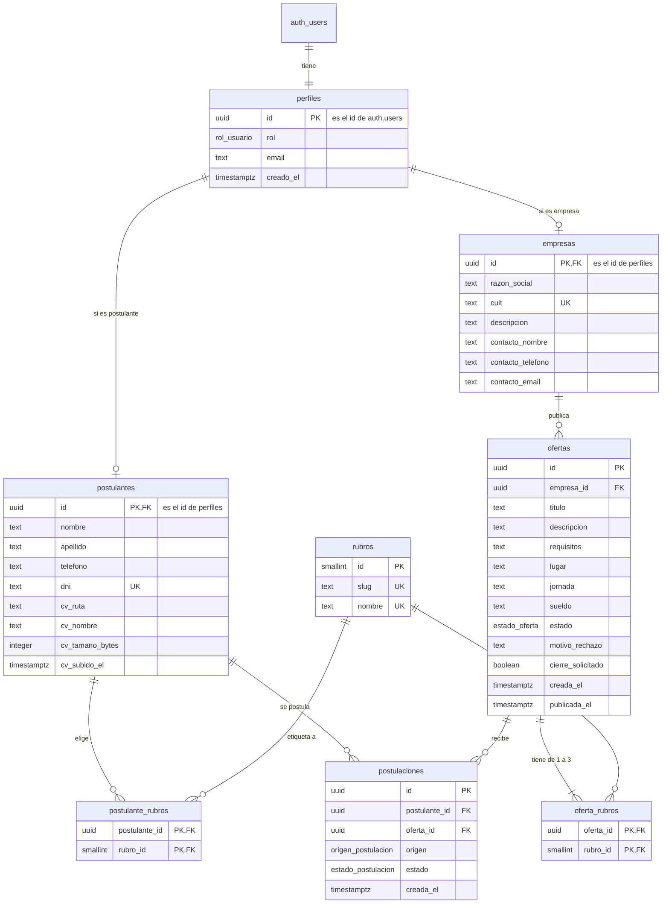

# Modelo de datos

Qué guarda la base del portal, cómo se relacionan las tablas y quién puede ver o cambiar cada cosa. Lo decidieron el usuario y el agente el 2026-09-29 (D-031, D-032).

**Estado:** aplicado en el proyecto de **testing** de Supabase (registro en `docs/migraciones.md`; la migración `20260929130000` está pendiente). El portal ya lee y guarda en esta base (D-035); no hay datos simulados. La primera migración (`profiles`, en inglés) no se modificó: una migración posterior la renombra (D-033).

## Resumen

- **8 tablas:** `perfiles`, `postulantes`, `empresas`, `rubros`, `postulante_rubros`, `ofertas`, `oferta_rubros` y `postulaciones`.
- **4 tipos de valores fijos (enums):** rol, estado de la oferta, estado de la postulación y origen de la postulación.
- **1 bucket privado:** `cvs`, con un PDF por postulante.
- Todo en español (D-031). Cada tabla tiene RLS desde la migración que la crea (RNF2).

## Convenciones

- **Nombres:** en español, tablas en plural y `snake_case`, sin tildes ni ñ (`tamano_bytes`, no `tamaño_bytes`). Las fechas terminan en `_el` y concuerdan con la tabla (`creada_el` en ofertas, `creado_el` en perfiles).
- **Ids:** `uuid` generado por la base (`gen_random_uuid()`). La excepción es `rubros`, que usa un número chico (`smallint`) porque es una lista fija y corta.
- **Una cuenta, un id:** `perfiles`, `postulantes` y `empresas` usan el mismo id que la cuenta de Supabase Auth. Así, "es tuyo" se escribe `postulante_id = auth.uid()`, sin consultas extra.
- **Fechas:** `timestamptz` (fecha y hora con zona). La pantalla las muestra en es-AR.
- **Textos:** `text` con un largo máximo (`check`). Los máximos son **los mismos que ya valida Zod** en `src/lib/validation/`, así la base es una segunda barrera y no una regla distinta. Donde Zod todavía no tiene máximo, se indica como "nuevo".
- **Vacíos:** en las tablas, "¿Vacía?" dice si la columna puede quedar sin valor (`null`).

## Valores fijos (enums)

| Enum | Valores | Qué muestra la pantalla |
|---|---|---|
| `rol_usuario` | `postulante`, `empresa`, `admin` | — |
| `estado_oferta` | `pendiente`, `publicada`, `rechazada`, `cerrada` | Pendiente, Publicada, Rechazada, Cerrada |
| `estado_postulacion` | `postulado`, `preseleccionado`, `derivado`, `no_apto` | Postulado, Pre-seleccionado, Derivado, No apto |
| `origen_postulacion` | `postulante`, `oficina` | — (lo usa la Oficina) |

## Tablas

### `perfiles`: una fila por cuenta

Guarda qué rol tiene cada cuenta. Reemplaza a `profiles` (D-010, D-011). Pantallas: todas, para decidir a dónde va cada persona al ingresar (D-020).

| Columna | Tipo | ¿Vacía? | Reglas | Para qué |
|---|---|---|---|---|
| `id` | `uuid` | no | PK; referencia `auth.users(id)`; si se borra la cuenta, se borra | El mismo id de la cuenta |
| `rol` | `rol_usuario` | no | Lo pone el trigger de alta; el usuario no lo puede cambiar | Qué portal usa |
| `email` | `text` | no | Lo copia un trigger desde `auth.users` y lo mantiene al día | La Oficina ve el email del postulante y de la empresa (D-030); con RLS, la app no puede leer `auth.users` |
| `creado_el` | `timestamptz` | no | Por defecto, ahora | Cuándo se creó la cuenta |

Quién puede qué: cada persona lee su propia fila; la Oficina lee todas. Nadie la crea, cambia ni borra desde la app: la crea el trigger y el rol admin se pone a mano (ver [Funciones y triggers](#funciones-y-triggers)).

### `postulantes`: datos del postulante y su CV

Los datos personales (P03, RF1.2.1) y el CV (P04, RF1.2.3). La fila la crea el trigger al registrarse; los datos quedan vacíos hasta que la persona los carga. Se piden solo los necesarios (Ley 25.326, Q-009).

| Columna | Tipo | ¿Vacía? | Reglas | Para qué |
|---|---|---|---|---|
| `id` | `uuid` | no | PK; referencia `perfiles(id)`; si se borra la cuenta, se borra | El mismo id de la cuenta |
| `nombre` | `text` | sí | Hasta 80 (nuevo) | Identificarlo |
| `apellido` | `text` | sí | Hasta 80 (nuevo) | Identificarlo |
| `telefono` | `text` | sí | Solo números, espacios y `+ - ( )`; hasta 30 (nuevo) | La Oficina lo llama a la pre-entrevista |
| `dni` | `text` | sí | 7 u 8 números, sin puntos; **único** | Identificarlo sin dudas y evitar cuentas repetidas |
| `cv_ruta` | `text` | sí | Si tiene valor, es `{id}/cv.pdf` | Dónde está el PDF en el bucket `cvs` |
| `cv_nombre` | `text` | sí | Hasta 255 (nuevo) | El nombre original del archivo, que muestra P04 |
| `cv_tamano_bytes` | `integer` | sí | Mayor que 0 | Lo muestran P04 y la Oficina |
| `cv_subido_el` | `timestamptz` | sí | — | Lo muestra P04 |

- Las cuatro columnas `cv_*` tienen valor todas juntas o ninguna (`check (num_nulls(...) in (0, 4))`). "Tiene CV" (RF1.4.4) es `cv_ruta is not null`.
- La ruta es siempre `{id}/cv.pdf`: subir otro CV reemplaza el anterior (DT-004). El `check` impide que alguien apunte su fila al archivo de otra persona.
- Quién puede qué: el postulante lee y edita su fila; la Oficina lee todas. Las empresas no ven nada (intermediación obligatoria).

### `empresas`: datos de la empresa

Razón social, CUIT, descripción y la persona de contacto (P10, RF1.3.2). La fila la crea el trigger al registrarse; los datos quedan vacíos hasta que la empresa completa P10. Puede publicar antes de completarlos (D-027, Q-014).

| Columna | Tipo | ¿Vacía? | Reglas | Para qué |
|---|---|---|---|---|
| `id` | `uuid` | no | PK; referencia `perfiles(id)`; si se borra la cuenta, se borra (salvo que tenga ofertas, ver `ofertas`) | El mismo id de la cuenta |
| `razon_social` | `text` | sí | Hasta 120 | Nombre legal |
| `cuit` | `text` | sí | Formato `XX-XXXXXXXX-X` (D-027); **único** | Identificarla |
| `descripcion` | `text` | sí | Hasta 1000 | A qué se dedica |
| `contacto_nombre` | `text` | sí | Hasta 120 | Con quién habla la Oficina |
| `contacto_telefono` | `text` | sí | Solo números, espacios y `+ - ( )`; hasta 30 (nuevo) | Contacto |
| `contacto_email` | `text` | sí | Hasta 254 (nuevo) | Contacto; puede ser distinto del email de la cuenta (por ejemplo, RR.HH.) |

Quién puede qué: la empresa lee y edita su fila; la Oficina lee todas. Los postulantes no ven nada de la empresa (DT-002).

### `rubros`: la lista de rubros

La lista predefinida de rubros u oficios (RF1.2.2). Es **una sola lista** para postulantes y ofertas (D-029, D-032). Se carga en la migración con los 11 rubros provisorios de `src/lib/validation/rubros.ts`; la lista definitiva y quién la mantiene siguen abiertas (Q-006).

| Columna | Tipo | ¿Vacía? | Reglas | Para qué |
|---|---|---|---|---|
| `id` | `smallint` | no | PK; lo numera la base | Referencia desde las otras tablas |
| `slug` | `text` | no | Único; minúsculas, números y guiones | El valor de la URL (`/ofertas?rubro=gastronomia`) |
| `nombre` | `text` | no | Único | Cómo se ve en pantalla ("Gastronomía") |

Quién puede qué: todos la leen, también sin sesión (filtro del catálogo). Nadie la cambia desde la app.

### `postulante_rubros`: los rubros de cada postulante

Une a cada postulante con **varios** rubros, para no encasillarlo (RF1.2.2). La Oficina busca postulantes por rubro en P16 (RF1.5.7).

| Columna | Tipo | ¿Vacía? | Reglas |
|---|---|---|---|
| `postulante_id` | `uuid` | no | Referencia `postulantes(id)`; si se borra el postulante, se borra |
| `rubro_id` | `smallint` | no | Referencia `rubros(id)`; no se puede borrar un rubro en uso |

- Clave primaria `(postulante_id, rubro_id)`: el mismo rubro no se repite.
- Índice `(rubro_id, postulante_id)`: la búsqueda por rubro de P16 responde rápido aunque el padrón crezca (RNF4).
- Quién puede qué: el postulante lee, agrega y quita los suyos; la Oficina lee todos.

### `ofertas`: las ofertas laborales

Lo que publica la empresa (P11), su estado y lo que decide la Oficina (P12, P15; RF1.3.3 a RF1.3.6, RF1.5.2 a RF1.5.4). La ven los postulantes en el catálogo cuando está publicada (P05, P06, RF1.4.1).

| Columna | Tipo | ¿Vacía? | Reglas | Para qué |
|---|---|---|---|---|
| `id` | `uuid` | no | PK | Va en la URL (`?oferta=<id>`) |
| `empresa_id` | `uuid` | no | Referencia `empresas(id)`; **no deja borrar** una empresa con ofertas | De quién es. De acá salen P12 y el contacto que ve la Oficina |
| `titulo` | `text` | no | Hasta 120 | El puesto |
| `descripcion` | `text` | no | Hasta 3000 | Las tareas |
| `requisitos` | `text` | no | Hasta 2000 | Qué necesita la persona (RF1.4.2) |
| `lugar` | `text` | no | Hasta 120 | Dónde es el trabajo |
| `jornada` | `text` | no | Hasta 120 | Días y horario |
| `sueldo` | `text` | sí | Hasta 120 (nuevo) | Opcional: "A convenir" o un monto (D-032) |
| `estado` | `estado_oferta` | no | Por defecto `pendiente`: no hay borradores (D-007) | Pendiente, Publicada, Rechazada o Cerrada |
| `motivo_rechazo` | `text` | sí | Hasta 500; **obligatorio si está rechazada** | Lo escribe la Oficina (RF1.5.3); lo lee solo la empresa dueña (RF1.3.5) |
| `cierre_solicitado` | `boolean` | no | Por defecto `false`; solo puede ser `true` si está publicada o cerrada; **para cerrarla tiene que ser `true`** | El pedido de cierre de la empresa: una marca, no un estado (D-008, RF1.3.6, RF1.5.4) |
| `creada_el` | `timestamptz` | no | Por defecto, ahora | Cuándo la envió la empresa |
| `publicada_el` | `timestamptz` | sí | Tiene valor si y solo si está publicada o cerrada; la pone la base al publicar | La muestra el catálogo y ordena "más recientes" (D-029) |

- Índices: `(estado, publicada_el desc)` para el catálogo y las pestañas de P15; `(empresa_id)` para P12.
- Borrar una empresa con ofertas falla a propósito: si no, se borrarían en silencio sus ofertas y las postulaciones de otras personas. Qué se hace en ese caso sigue abierto (Q-010).
- Nadie borra ofertas (Q-002).
- Quién puede qué:
  - Sin sesión y postulantes: leen solo las publicadas.
  - Empresa: lee las suyas en cualquier estado; las crea en `pendiente` (con `crear_oferta`); de una publicada solo puede marcar `cierre_solicitado`, sin poder desmarcarlo (Q-003). Lo aseguran los permisos por columna (solo se pueden cambiar `estado`, `motivo_rechazo` y `cierre_solicitado`) y el trigger `antes_de_actualizar_oferta`, que no deja a nadie fuera de la Oficina cambiar el estado ni el motivo.
  - Oficina: lee todas; publica, rechaza con motivo y cierra.

### `oferta_rubros`: los rubros de cada oferta

Cada oferta tiene **de 1 a 3 rubros** (D-032, reemplaza "un rubro" de D-029). Así, "Repartidor para rotisería" aparece tanto en Gastronomía como en Transporte, y en P16 la Oficina encuentra postulantes de cualquiera de los rubros de la oferta.

| Columna | Tipo | ¿Vacía? | Reglas |
|---|---|---|---|
| `oferta_id` | `uuid` | no | Referencia `ofertas(id)`; si se borra la oferta, se borra |
| `rubro_id` | `smallint` | no | Referencia `rubros(id)`; no se puede borrar un rubro en uso |

- Clave primaria `(oferta_id, rubro_id)`. Índice `(rubro_id, oferta_id)` para filtrar el catálogo por rubro.
- La oferta y sus rubros se guardan **juntos** con la función `crear_oferta`: por la API de Supabase serían dos pedidos separados, y si fallara el segundo quedaría una oferta sin rubros. La función controla que sean de 1 a 3.
- El máximo de 3 mantiene las tarjetas legibles en el celular y evita que una empresa marque todos para aparecer en todos los filtros.
- Quién puede qué: cada uno lee los rubros de las ofertas que puede ver (sigue a `ofertas`); la empresa los crea junto con su oferta.

### `postulaciones`: quién se postuló a qué

Una fila por postulante y oferta (P06, P07, P15, P16; RF1.2.4, RF1.4.3, RF1.5.5, RF1.5.6, RF1.5.8).

| Columna | Tipo | ¿Vacía? | Reglas | Para qué |
|---|---|---|---|---|
| `id` | `uuid` | no | PK | La Oficina cambia el estado por este id |
| `postulante_id` | `uuid` | no | Referencia `postulantes(id)`; si se borra el postulante, se borra | Quién |
| `oferta_id` | `uuid` | no | Referencia `ofertas(id)` | A qué oferta |
| `origen` | `origen_postulacion` | no | Por defecto `postulante` | `oficina` si la asoció la Oficina desde P16 (Q-007). El postulante igual la ve en P07 |
| `estado` | `estado_postulacion` | no | Por defecto `postulado` | La evaluación de la Oficina (RF1.5.6). **El postulante nunca lo ve** (RF1.2.4, ver DT-007) |
| `creada_el` | `timestamptz` | no | Por defecto, ahora | La fecha que ve el postulante en P07 |

- `unique (postulante_id, oferta_id)`: no hay dos postulaciones iguales. Postularse de nuevo no es un error para la persona (D-024): el caso de uso responde como si fuera la primera vez.
- Índice `(oferta_id)` para la lista de postulantes de cada oferta en P15.
- Nadie borra postulaciones (D-023).
- Quién puede qué:
  - Postulante: lee las suyas; crea con origen `postulante`, solo a una oferta publicada.
  - Oficina: lee todas; crea con origen `oficina` (P16); cambia el estado entre cualquiera de los 4 (D-030).
  - Empresa: nada (intermediación obligatoria, D-023).

## Quién puede qué (resumen de RLS)

| Tabla | Postulante | Empresa | Oficina (admin) | Sin sesión |
|---|---|---|---|---|
| `perfiles` | lee la suya | lee la suya | lee todas | — |
| `postulantes` | lee y edita la suya | — | lee todas | — |
| bucket `cvs` | sube, reemplaza, borra y lee su propio archivo | — | abre con URL firmada | — |
| `empresas` | — | lee y edita la suya | lee todas | — |
| `rubros` | lee | lee | lee | lee |
| `postulante_rubros` | lee, agrega y quita los suyos | — | lee todos | — |
| `ofertas` | lee publicadas | lee las suyas, crea, pide cierre | lee todas, publica, rechaza, cierra | lee publicadas |
| `oferta_rubros` | lee si ve la oferta | lee las suyas, las crea con la oferta | lee todos | lee si ve la oferta |
| `postulaciones` | lee las suyas, crea a una publicada | — | lee todas, crea desde P16, cambia el estado | — |

RLS filtra **filas**, no columnas: quien puede leer una fila puede leer todas sus columnas. Por eso el estado de la postulación queda anotado como deuda (DT-007).

## Funciones y triggers

- **`private.es_admin()`**: dice si la cuenta que consulta es de la Oficina, leyendo `perfiles.rol`. La usan las políticas como `(select private.es_admin())`. Vive en el esquema `private`, que la API no expone, y corre con permisos del dueño (`security definer`) para poder leer `perfiles` sin chocar con su propia RLS.
- **`crear_perfil()`** (trigger al crear una cuenta; reemplaza `handle_new_user`):
  - crea la fila de `perfiles` con el email y el rol: `empresa` si el registro lo pidió en el metadata (`rol: "empresa"`), `postulante` en cualquier otro caso (D-011);
  - crea la fila vacía en `postulantes` o en `empresas` según el rol.
- **Sincronizar el email** (trigger al cambiar el email en `auth.users`): actualiza `perfiles.email`.
- **`crear_oferta(titulo, descripcion, requisitos, lugar, jornada, sueldo, rubros)`**: guarda la oferta y sus rubros en una sola transacción y controla que sean de 1 a 3. La empresa sale de la sesión, nunca de un parámetro. Corre con los permisos de quien la llama (`security invoker`), así RLS se aplica igual que en un insert común. El DAL la llama con `rpc` y recibe el id de la oferta nueva.
- **`antes_de_actualizar_oferta`** (trigger antes de cambiar una oferta): RLS no puede comparar la fila vieja con la nueva, así que este trigger lo hace. Solo la Oficina cambia el estado o el motivo, y al publicar pone `publicada_el` con la hora de la base.
- **Dar de alta a una operadora** (a mano, RF1.1.4): se crea la cuenta y después, en el editor SQL:
  1. `update perfiles set rol = 'admin' where id = '<id>';`
  2. `delete from postulantes where id = '<id>';` para que no aparezca en el buscador de postulantes (P16).

## Bucket `cvs`

- **Privado** (RNF1). Solo PDF (`application/pdf`), hasta 5 MB (provisorio, DT-004, Q-005). La app además revisa los primeros bytes (`%PDF-`) en `src/lib/validation/cv.ts`.
- Un archivo por postulante, siempre en `{id del postulante}/cv.pdf`. Subir otro lo reemplaza.
- El postulante maneja solo su archivo, y solo si es postulante. Reemplazar un archivo (`upsert`) exige en Supabase permiso para subir, leer y actualizar (documentación de Storage, "Access control"). Por eso el postulante puede bajar su propio CV por la API. No expone datos de nadie más, y la pantalla igual no lo ofrece (D-026).
- La Oficina lo abre con una **URL firmada que vence enseguida**, generada en el servidor (D-030).

## Qué regla vive dónde

La regla de negocio está en el caso de uso (D-018). La base repite las que protegen datos o la coherencia, como segunda barrera.

| Regla | Caso de uso | Base |
|---|---|---|
| Solo se publica o rechaza una oferta pendiente; solo se cierra una publicada | Sí (409 "Esta oferta ya fue revisada.") | Checks de coherencia (`publicada_el`, `cierre_solicitado`) |
| Solo la Oficina cambia el estado de una oferta | Sí (403) | Trigger `antes_de_actualizar_oferta` |
| Rechazar exige motivo (RF1.5.3) | Sí (400) | `check` |
| Cerrar exige el pedido de la empresa (RF1.5.4) | Sí (409) | `check` |
| La empresa pide el cierre solo de una publicada (RF1.3.6) | Sí (409) | `check` + RLS |
| De 1 a 3 rubros por oferta | Zod | `crear_oferta` (un insert directo en `oferta_rubros`, solo posible en una oferta propia y pendiente, no tiene tope) |
| Postularse solo a una oferta publicada | Sí (404) | RLS |
| Postularse exige CV (RF1.4.4) | Sí (409) | RLS |
| No duplicar postulaciones (D-024) | Responde como éxito | `unique` |
| Cualquier cambio entre los 4 estados de la postulación (D-030) | Sí | — |
| Qué campos ve cada rol (DTO) | Sí | RLS por filas (ver DT-007) |
| DNI y CUIT no repetidos | Mensaje que deriva a la Oficina, sin confirmar de quién es | `unique` |
| Mínimo de rubros del postulante | Se define al construir P03 | — |

## Qué queda afuera (y por qué)

- **Registro de quién hizo qué:** solo se guarda el estado actual, sin operadora ni fecha de cada cambio (D-032, DT-006).
- **Derivaciones a la empresa, ternas, CIT y seguimiento a 60 días:** fuera del MVP (AGENTS §2, Q-013). "Derivado" es solo un estado de la postulación. La cantidad de rechazos se puede contar con `estado = 'no_apto'` cuando haga falta.
- **Carga asistida por operadoras** (postulantes sin cuenta): fuera del MVP (Q-011). Si entra, `postulantes` necesita un id propio y la cuenta pasa a ser opcional: es una migración.
- **Rubro de la empresa:** RF1.3.2 no lo pide.
- **Barrio y fecha de nacimiento del postulante:** no se piden (Q-009).
- **Borradores de ofertas:** no existen (D-007).

## Preguntas abiertas que no cambian el esquema

| Pregunta | Qué cambiaría |
|---|---|
| Q-002 editar una oferta rechazada | Nada: vuelve a `pendiente` con un `update`. Si la Oficina puede borrar, se agrega una política de borrado |
| Q-003 cancelar o rechazar el pedido de cierre | Nada: `cierre_solicitado` vuelve a `false` |
| Q-005 tamaño del CV | El límite del bucket y la constante de `cv.ts` |
| Q-006 contenido de la lista de rubros | Las filas de `rubros`; si la Oficina la edita desde la app, políticas de escritura para admin |
| Q-010 baja de cuenta | Qué hacer con las ofertas de una empresa que se va |
| Q-012 indicadores | Consultas; quizás un índice |
| Q-014 validar empresas | Una columna en `empresas` (por ejemplo, `validada_el`) |

## De la base a la pantalla

Cómo se arman los datos que ya usan las pantallas (`src/lib/validation/`). El caso de uso los construye; los nombres del DTO siguen en camelCase.

| DTO | Sale de |
|---|---|
| `OfertaPublica` | `ofertas` publicada + sus `rubros` (slugs) + `yaTePostulaste` (existe una fila en `postulaciones` del postulante con sesión) |
| `OfertaEmpresa` | `ofertas` de la empresa + sus `rubros`; `motivoRechazo` solo si está rechazada |
| `OfertaOficina` | `ofertas` + `empresas` (contacto) + `perfiles.email` de la empresa + cantidad de `postulaciones` |
| `PostulacionPropia` | `postulaciones` del postulante (`creada_el` → `postuladoEl`) + título y lugar de la oferta; **sin estado** |
| `PostulacionOficina` | `postulaciones` + `perfiles.email` y el CV de `postulantes` (nombre y teléfono cuando exista P03) |
| `CvPropio` | `postulantes.cv_nombre`, `cv_tamano_bytes`, `cv_subido_el` |
| `PerfilEmpresa` | `empresas` |
| `ResumenOficina` | Conteos sobre `ofertas` y `postulaciones` (provisorio, Q-012) |

Los DTOs ya usan `rubros` (de 1 a 3), `sueldo` y los valores de estado en español. Los arman los casos de uso (`src/lib/use-cases/`) con lo que devuelve el DAL (`src/lib/dal/`).

## Diferencias con el borrador de Supabase

El usuario tenía un borrador hecho en el editor de Supabase. Se compararon los dos modelos y quedó este. Qué cambió y por qué:

| Borrador | Este modelo | Por qué |
|---|---|---|
| `ofertas.empresa_nombre` (texto) | `ofertas.empresa_id` (relación) | Sin la relación no se sabe de quién es cada oferta: P12, la RLS de la empresa (RNF2) y el contacto que ve la Oficina dependen de ella |
| `ofertas` sin motivo, pedido de cierre ni fecha de publicación | `motivo_rechazo`, `cierre_solicitado`, `publicada_el` | RF1.3.5, RF1.3.6, RF1.5.3, RF1.5.4 y el orden del catálogo |
| `ofertas` sin requisitos, lugar ni jornada | Los tres, más `sueldo` opcional | RF1.4.2 y lo que ya carga P11 |
| `usuarios` con nombre, apellido y teléfono obligatorios | `perfiles` con rol y email; los datos personales en `postulantes`, el contacto en `empresas` | El registro pide solo email y contraseña (D-020); cada rol carga sus datos en su pantalla (P03, P10) |
| `postulantes.id` propio más `usuario_id` | `postulantes.id` es el id de la cuenta | Políticas RLS de una línea, sin subconsultas |
| `postulantes.cv_url` | `cv_ruta`, `cv_nombre`, `cv_tamano_bytes`, `cv_subido_el` | No hay URL pública (RNF1): se guarda la ruta y la Oficina recibe un link firmado. Los demás datos los muestran P04 y P15. La idea de guardar el CV en `postulantes` es del borrador |
| `categorias` | `rubros`, con `slug` | Un nombre por concepto (AGENTS §3): el código y la URL ya dicen "rubro" |
| `oferta_categorias` | `oferta_rubros` (de 1 a 3) | Se mantuvo la idea de varias por oferta, con un máximo |
| `derivaciones` | — | Fuera del MVP (terna, devolución de la empresa, seguimiento) |
| `empresas.rubro` | — | RF1.3.2 no lo pide |
| `created_at`, `updated_at` | `creada_el` (sin `updated_at`) | Nombres en español (D-031); solo el estado actual (D-032) |
| `postulaciones` sin origen | `origen` | Q-007 |
