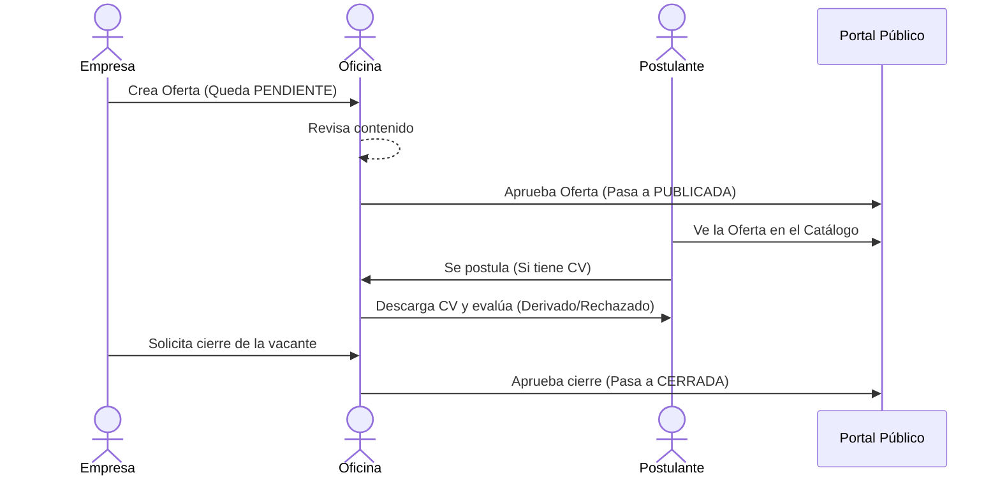

# 🗺️ Flujos de Usuario del Portal

Este documento detalla el recorrido de los usuarios dentro de la plataforma. El sistema gira en torno a tres actores principales con permisos y visiones completamente distintas, unidos por la regla de oro del negocio: **La Oficina de Empleo es el único intermediario válido.**

---

## 🎭 Los Tres Actores

- 👷 **Postulante:** Ciudadano que busca trabajo. Sube su CV y se anota a ofertas.
- 🏢 **Empresa:** Compañía local. Publica ofertas de trabajo y pide darlas de baja.
- 🏛️ **Oficina de Empleo (Admin):** Modera todo. Aprueba ofertas, revisa CVs y vincula postulantes con empresas.

---

## ✅ 1. Flujos Completados (En Producción)

### A. Flujos Transversales (Acceso)
- **Registro y Autenticación:** 
  - **Empresas y Postulantes:** Se registran con Email y Contraseña. El sistema requiere confirmación de correo. Si se olvidan la clave, piden un link de recuperación.
  - **Oficina de Empleo:** No tiene registro público. Sus cuentas son creadas a mano por un administrador de base de datos.
- **Redirección Inteligente (`?volver=`):** Si un usuario intenta hacer una acción protegida (ej. postularse) sin estar logueado, el sistema lo invita a ingresar o registrarse, y luego lo devuelve exactamente a la pantalla donde estaba.

### B. El Ciclo de Vida de una Oferta (El Flujo Principal)

1. **Creación (Empresa):** Ingresa a su panel y llena el formulario de nueva oferta. Asigna entre 1 y 3 rubros obligatorios (ej. Gastronomía, Limpieza). Nace en estado **Pendiente** (no hay borradores).
2. **Moderación (Oficina):** Ve la alerta en su panel. 
   - *Aprueba:* Pasa a estado **Publicada** y aparece en el catálogo público.
   - *Rechaza:* Exige escribir un **Motivo de Rechazo**. La empresa verá este motivo en su panel.
3. **Solicitud de Cierre (Empresa):** Presiona "Pedir el cierre". Esto levanta una "bandera" (flag) a la Oficina, la oferta sigue online.
4. **Cierre Definitivo (Oficina):** Aprueba la bandera de cierre y pasa la oferta a estado **Cerrada**. Deja de ser visible al público.

### C. El Flujo de Postulación
1. **Búsqueda:** Cualquier persona (incluso sin cuenta) entra a `/ofertas`. Busca por palabras clave o filtra por rubros.
2. **Postulación Activa:** 
   - *Bloqueo:* Si no subió su CV, el sistema lo manda a subirlo (solo PDF hasta 5MB).
   - *Éxito:* Si tiene CV, la postulación se confirma.
3. **Seguimiento Ciego:** El postulante ve el registro en "Mis Postulaciones". **Jamás verá el estado interno** (Regla de opacidad para evitar frustraciones directas). 

### D. El Flujo de Evaluación (Oficina)
1. **Revisión:** Entra a una oferta publicada y ve la lista de postulantes.
2. **Lectura de CV:** Clic en "Ver CV" genera un link temporal seguro que **vence en 1 minuto** para abrir el PDF.
3. **Toma de Decisión:** Cambia el estado del candidato a discreción entre: *Postulado, Pre-seleccionado, Derivado, o No Apto*.

---

## 🚧 2. Flujos Faltantes (Próximo Sprint)

### A. Perfil Completo del Postulante
- **El Problema Hoy:** Solo tenemos email y PDF. Faltan datos duros (DNI, Nombre, Teléfono).
- **El Flujo Nuevo:** 
  1. El postulante entra a "Mi Perfil".
  2. Completa DNI (único), Nombre, Apellido, Teléfono.
  3. Selecciona **todos los rubros/oficios** que sabe hacer (sin límite). 

### B. Búsqueda Proactiva / "Caza de Talentos"
- **El Problema Hoy:** La Oficina solo espera postulantes pasivos.
- **El Flujo Nuevo:** 
  1. La Oficina filtra en el **Buscador de Padrón** por el rubro "Construcción".
  2. El sistema cruza perfiles y devuelve lista de albañiles.
  3. La operadora elige a un ciudadano y lo "Vincula a Oferta XYZ". 
  4. El sistema crea una postulación artificial (`origen = 'oficina'`). Al ciudadano le aparece en su lista.
