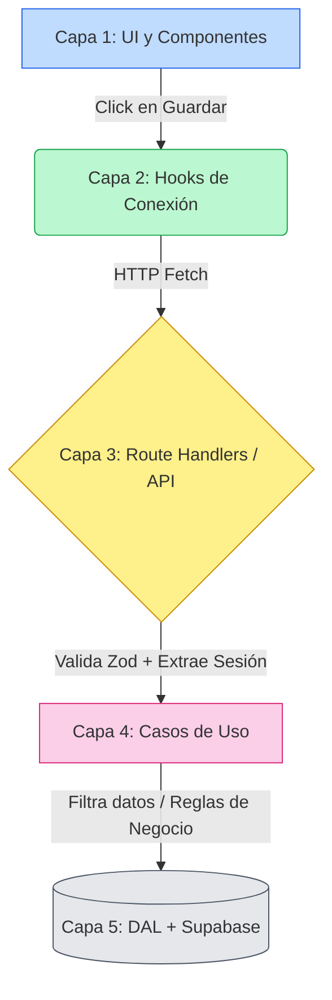

# 🏗️ Arquitectura Técnica del Portal

Para conocer el portal "de pies a cabeza" a nivel código, necesitás entender cómo fluye un dato desde que el usuario hace un clic en el navegador, hasta que se guarda en la base de datos.

## 🛠️ El Stack (Las Tecnologías)
- **Framework Core:** Next.js 16 (App Router) y React 19.2. (TypeScript Estricto).
- **Estilos y UI:** Tailwind CSS v4, Base UI, y `shadcn/ui`.
- **Backend-as-a-Service:** Supabase (PostgreSQL, Autenticación, Storage para PDFs).
- **Validaciones:** Zod (Asegura la forma de los datos).
- **Testing:** Vitest (Lógica y Casos de Uso) y Playwright (Navegación E2E).

---

## 🥞 La Arquitectura en 5 Capas (Decisión D-018)

El proyecto separa responsabilidades brutalmente. **El frontend web no sabe nada de SQL, y la base de datos no sabe nada de HTML.**

### Capa 1: UI (Componentes y Pantallas) 
- **📍 Directorio:** `src/app/` y `src/components/`
- Renderizan botones, formularios y colores ("Mosaico de oficios"). 
- **Regla de oro:** No hacen consultas directas a BD. Si necesitan guardar algo, llaman a un Hook. Por defecto todo corre en el Servidor (Server Components) para ahorrar batería y datos móviles al ciudadano, salvo interactividad estricta (`"use client"`).

### Capa 2: Hooks de Conexión 
- **📍 Directorio:** `src/hooks/`
- Encapsulan el estado visual (`Loading`, `Success`, `Error`). 
- Disparan `fetch` nativo hacia nuestra API interna. 

### Capa 3: Route Handlers (La Puerta del Backend) 
- **📍 Directorio:** `src/app/api/...`
- **Responsabilidades:**
  1. Revisar el paquete HTTP con **Zod** (ej. "El DNI no puede tener letras").
  2. Preguntarle a Supabase "¿Quién es el usuario?" (`getCurrentUser`). Si no hay, patea un `401 Unauthorized`.
  3. Le pasa los datos limpios a la Capa 4.

### Capa 4: Casos de Uso (El Cerebro) 
- **📍 Directorio:** `src/lib/use-cases/`
- Acá viven las **Reglas de Negocio**. Son funciones puras de TypeScript.
- **Responsabilidades:**
  1. **Autorización Fina:** "La empresa quiere cerrar la oferta, ¿La oferta está publicada? Sí, procedemos. No, fallamos (409 Conflict)".
  2. **DTOs (Data Transfer Objects):** "Censuran" los datos. Ej: A la Empresa le entrega la lista de ofertas, pero le elimina por código los datos personales de los postulantes.

### Capa 5: DAL (Data Access Layer - Los Músculos)
- **📍 Directorio:** `src/lib/dal/`
- Funciones crudas que hacen las consultas (`SELECT`, `INSERT`) a Supabase mediante `@supabase/supabase-js`.
- **Inyección de Sesión:** Cada consulta HTTP del servidor hacia la BD en Supabase viaja con la credencial del usuario. Esto es vital para activar el escudo final de seguridad (RLS).

---

## 💡 3 Claves Técnicas de este Proyecto

1. **Simetría de Rutas (`src/proxy.ts`):** 
   Next.js intercepta todo con un `middleware` (acá llamado `proxy.ts`). Si un Postulante tipea la URL `/admin`, el proxy corta la carga y lo manda a su propio panel.
2. **Sin Borradores, Ni Basura (D-007):**
   A nivel BD y UI, nada queda "a medio guardar". Cuando se publica, entra de lleno a la base en estado "Pendiente". 
3. **100% Español en Dominio (D-014 y D-031):**
   Rutas, tablas, DTOs y hooks de negocio están en Español (`Oferta`, `useOferta`, `ofertas`). El código técnico genérico se mantiene en Inglés (`isLoading`, `error`).
