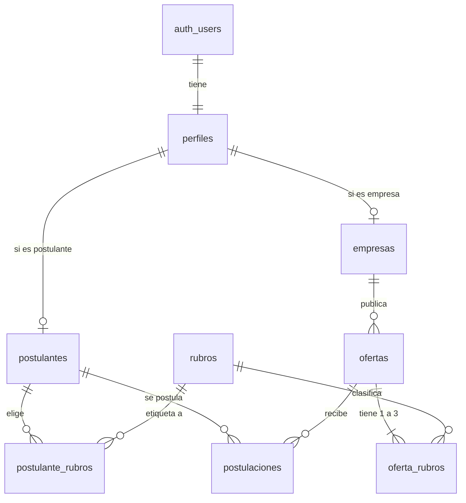

# 🛡️ Modelo de Datos y Seguridad

Este es el documento más crítico para entender por qué la app es segura frente a la **Ley 25.326 de Protección de Datos Personales de Argentina**.

En sistemas clásicos, el programador filtra con un `if` qué datos enviarle a cada usuario. **Acá no**. En este portal, la base de datos (PostgreSQL en Supabase) bloquea intrusiones directamente en el motor usando **RLS (Row Level Security)**.

---

## 💾 1. El Modelo Relacional (Tablas)

Todo está en estricto español, en minúsculas (`snake_case`). Son 8 tablas principales.

1. **`perfiles`**: El corazón. Un trigger automático en la base clava el rol (`postulante`, `empresa` o `admin`) apenas el usuario se registra. **Nadie puede cambiar su propio rol.**
2. **`postulantes` / `empresas`**: Almacenan los datos duros según el rol (DNI vs CUIT).
3. **`ofertas`**: Las vacantes publicadas.
4. **`rubros`**: Catálogo maestro de oficios fijos (Ej. "Gastronomía").
5. **`postulaciones`**: Une postulante con oferta, y guarda la "nota secreta" de la oficina (el estado de la evaluación).

---

## 🛑 2. RLS (Row Level Security) - La Barrera Definitiva

RLS es una tecnología de PostgreSQL que adjunta una regla de seguridad **a cada fila de una tabla de forma independiente**. 

> **Ejemplo Crítico:**
> Si un hacker inyecta código en Next.js para ejecutar `SELECT * FROM postulantes` (intentando robar DNIs):
> Como la consulta viaja con el token de sesión de una empresa, RLS intercepta la consulta adentro de PostgreSQL y devuelve 0 filas. **Los registros que no son tuyos son literalmente invisibles a nivel motor de base de datos.**

- **`postulantes`:** Un postulante solo puede ver/editar su fila (`WHERE id = auth.uid()`). La Oficina ve todas. La Empresa cero.
- **`ofertas`:** Público sin cuenta ve solo `estado = 'publicada'`. Una Empresa ve solo las que ella creó. La Oficina ve todas.
- **`postulaciones`:** La empresa no ve ninguna.

---

## 📄 3. Seguridad de los Archivos CVs (Storage)

Los Curriculum Vitae contienen PII (Personally Identifiable Information). Por la Regla **RNF1**, no pueden tener links públicos.

1. Se guardan en un Storage Bucket de Supabase llamado `cvs`.
2. El bucket está configurado como **Privado**. No hay URL estática.
3. El postulante `123` sube su CV, guardándose en `123/cv.pdf`. Si sube otro, reemplaza al viejo.
4. **Link Autodestructible:** Cuando la Oficina hace clic en "Ver CV", el Backend genera una URL Firmada (Signed URL) y redirige. **Esa URL se autodestruye a los 60 segundos.** Si el admin reenvía el link por WhatsApp para verlo mañana, el servidor lo rechazará.

---

## ✂️ 4. DTOs (Data Transfer Objects) - Censura por Código

Como RLS oculta "filas enteras", usamos los Casos de Uso para ocultar "columnas específicas" antes de mandar los datos por internet.

- **El Secreto del Estado de Postulación (RF1.2.4):**
  - La tabla tiene la columna `estado` (ej. "Rechazado").
  - El postulante tiene permiso para leer toda su fila por RLS.
  - Pero el Caso de Uso en el código agarra el registro, **le elimina la propiedad `estado` por completo**, y recién ahí lo manda a la pantalla del postulante. Jamás viajará por la red un "Rechazado" al celular del ciudadano.
- **El Motivo de Rechazo de Ofertas:**
  - El Caso de Uso `OfertaEmpresa` solo adjunta el texto del rechazo si el usuario es el dueño de la oferta, y si la oferta efectivamente está rechazada.
